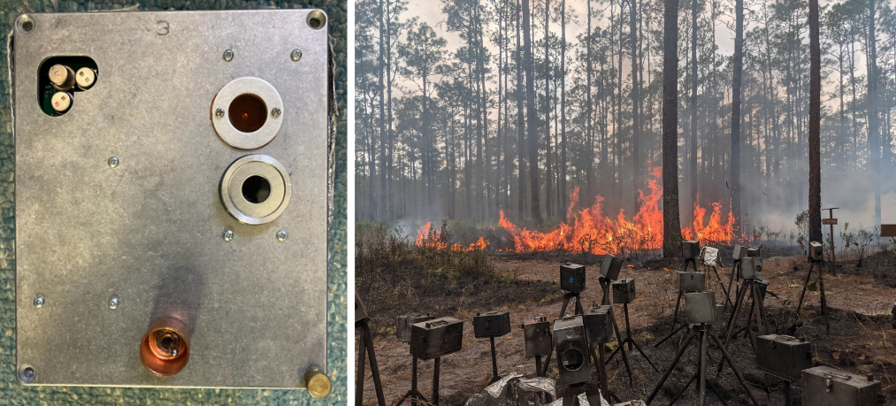

.. KremBoxer documentation master file, created by
   sphinx-quickstart on Thu Jan 12 14:14:31 2023.
   You can adapt this file completely to your liking, but it should at least
   contain the root `toctree` directive.

Welcome to KremBoxer's documentation!
=====================================

This Python 3 code performs calibration and FRP computation with data gathered by the dualband 'krembox' detectors.  More documentation will follow, but for now here is a quick start guide.  

**NOTE**: So far this has only been tested on Ubuntu, but in principle it should work on Windows and Mac too.  We might just need to work through some OS specific file path issues.

The repo includes data for the sensor bandpasses, temperature sensor calibration, and blackbody calibration data for one of Bob's radiometers in `calibration_data`.  This calibration data is valid for the radiometers used during the Osceola and Fort Stewart 2022 prescribed burns.  Note that the calibration from one radiometer (unit 11, in this case) is applied to all the datasets.  We believe that this is adequate because Bob has seen that the sensor have nearly ideentical responses.  However, this shortcut should be checked for any new batch of sensors.

.. toctree::
   :maxdepth: 2
   
   usage
   methods
   burnunits
   api
   documentation

